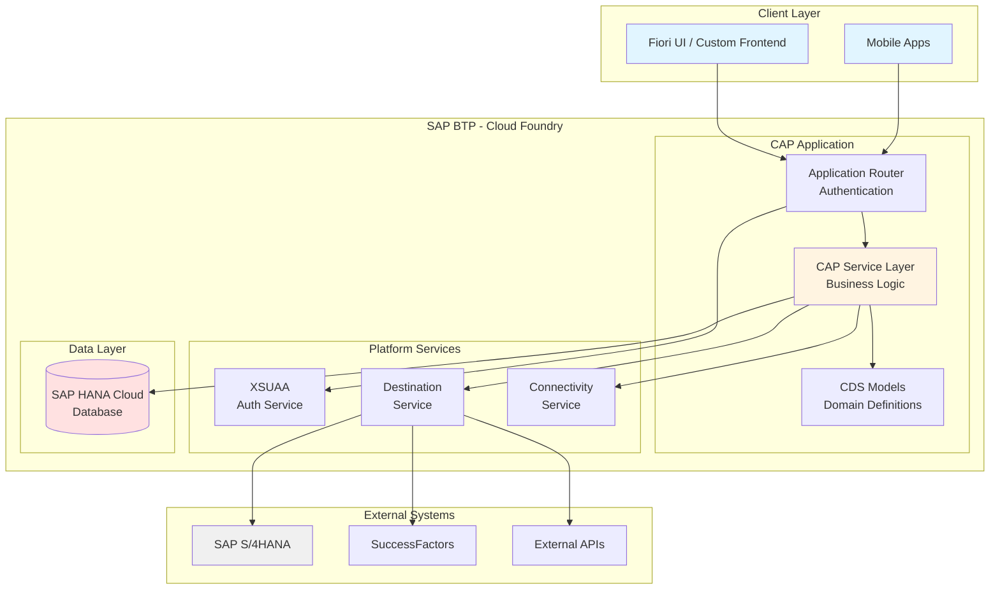
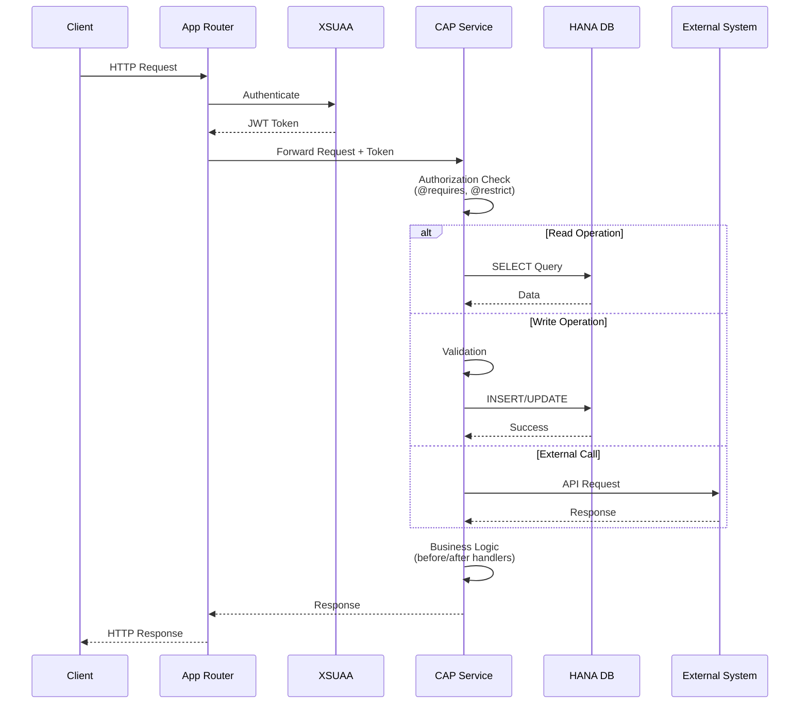
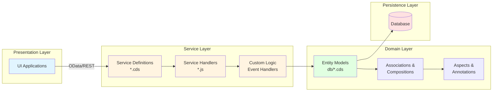

# CloudeSpoon

A cloud-native enterprise application built with SAP Cloud Application Programming (CAP) model for SAP Business Technology Platform (BTP).

## Table of Contents
- [Overview](#overview)
- [System Architecture](#system-architecture)
- [Project Structure](#project-structure)
- [Prerequisites](#prerequisites)
- [Setup Instructions](#setup-instructions)
- [Development](#development)
- [Deployment](#deployment)
- [Resources](#resources)

## Overview

CloudeSpoon is an enterprise-grade application leveraging the SAP Cloud Application Programming (CAP) model. CAP provides a proven framework for building applications with:

- **Domain-driven design** with CDS (Core Data Services) modeling
- **Built-in multitenancy** for SaaS applications
- **Automatic OData/REST API** generation
- **Enterprise-grade security** with role-based access control
- **Seamless SAP integration** with S/4HANA, SuccessFactors, and other SAP services

## System Architecture

### High-Level Architecture



### CAP Request Flow



### CAP Layer Architecture



## Project Structure

Once initialized with `cds init`, the project follows this structure:

```
CloudeSpoon/
├── app/                      # UI applications
│   ├── fiori/               # Fiori Elements apps
│   └── custom/              # Custom UI apps
├── db/                       # Database layer
│   ├── data-model.cds       # Entity definitions
│   ├── schema.cds           # Database schema
│   └── data/                # Initial/master data (CSV)
├── srv/                      # Service layer
│   ├── service.cds          # Service definitions
│   ├── service.js           # Service implementations
│   └── handlers/            # Custom business logic
├── test/                     # Test files
│   ├── unit/
│   └── integration/
├── package.json             # Project configuration
├── .cdsrc.json              # CAP configuration
├── mta.yaml                 # Multi-target app descriptor
└── xs-security.json         # Security configuration
```

## Prerequisites

### Required Software

1. **Node.js** (v18 or higher)
   ```bash
   node --version  # Should be v18.x or higher
   ```

2. **SAP CDS CLI** (CAP Development Kit)
   ```bash
   npm install -g @sap/cds-dk
   ```

3. **Cloud Foundry CLI** (for BTP deployment)
   ```bash
   # Download from: https://github.com/cloudfoundry/cli/releases
   cf --version
   ```

4. **MBT Build Tool** (for MTA builds)
   ```bash
   npm install -g mbt
   ```

### Optional Tools

- **SQLite** (for local development - usually included with Node.js)
- **Docker** (for containerized development)
- **Visual Studio Code** with SAP CDS extension

## Setup Instructions

### 1. Clone the Repository

```bash
git clone https://github.com/lolek24/CloudeSpoon.git
cd CloudeSpoon
```

### 2. Initialize CAP Project Structure

```bash
# Initialize a new CAP project (if not already done)
cds init

# Install dependencies
npm install
```

### 3. Local Development Setup

```bash
# Option 1: Using cds watch (recommended for development)
cds watch

# Option 2: Using cds serve
cds serve

# The application will be available at http://localhost:4004
```

### 4. Database Setup

#### SQLite (Local Development)

```bash
# Deploy schema to local SQLite database
cds deploy --to sqlite

# The database file will be created at ./sqlite.db
```

#### SAP HANA Cloud (Production)

```bash
# Bind to HANA service instance
cf bind-service cloudespoon-app cloudespoon-hana

# Deploy schema
cds deploy --to hana
```

### 5. Create Sample Entities (Example)

Create a sample data model in `db/schema.cds`:

```cds
namespace cloudespoon;

entity Products {
  key ID : UUID;
  name : String(100);
  description : String(500);
  price : Decimal(10,2);
  stock : Integer;
  createdAt : Timestamp;
  modifiedAt : Timestamp;
}
```

Create a service in `srv/service.cds`:

```cds
using cloudespoon from '../db/schema';

service CatalogService {
  entity Products as projection on cloudespoon.Products;
}
```

### 6. Run and Test

```bash
# Start the server
cds watch

# Access the service metadata
# http://localhost:4004/catalog/

# Access Fiori preview
# http://localhost:4004/fiori-preview.html
```

## Development

### Common Commands

```bash
# Start development server with hot reload
cds watch

# Compile CDS models
cds compile srv/service.cds

# Deploy database schema
cds deploy --to sqlite

# Run tests
npm test

# Lint code
npm run lint

# Build for production
cds build
```

### Adding Custom Logic

Create custom handlers in `srv/service.js`:

```javascript
module.exports = (srv) => {
  // Before CREATE
  srv.before('CREATE', 'Products', async (req) => {
    req.data.createdAt = new Date();
  });

  // After READ
  srv.after('READ', 'Products', (products) => {
    // Custom logic after reading products
  });

  // Custom action
  srv.on('calculateDiscount', async (req) => {
    const { productId, discountPercent } = req.data;
    // Business logic here
  });
};
```

### Environment Variables

Create `.env` file for local development:

```env
CDS_ENV=development
DEBUG=*
PORT=4004
```

## Deployment

### Deploy to SAP BTP Cloud Foundry

#### 1. Login to Cloud Foundry

```bash
cf login -a https://api.cf.YOUR-REGION.hana.ondemand.com
```

#### 2. Build MTA Archive

```bash
# Build the multi-target application
mbt build

# The .mtar file will be created in mta_archives/
```

#### 3. Deploy to BTP

```bash
# Deploy the application
cf deploy mta_archives/CloudeSpoon_*.mtar

# Check application status
cf apps

# View logs
cf logs cloudespoon-app --recent
```

#### 4. Create Service Instances

```bash
# Create HANA instance
cf create-service hana hdi-shared cloudespoon-hana

# Create XSUAA instance
cf create-service xsuaa application cloudespoon-auth

# Create destination service
cf create-service destination lite cloudespoon-dest
```

### Monitoring

```bash
# View application logs
cf logs cloudespoon-app

# Check application health
cf app cloudespoon-app

# View metrics
cf app cloudespoon-app --guid
```

## Development Workflow

### 1. Create Feature Branch

```bash
git checkout -b feature/your-feature-name
```

### 2. Develop and Test

```bash
# Start development server
cds watch

# Make changes to CDS models, services, or handlers
# Server will automatically reload
```

### 3. Commit Changes

```bash
git add .
git commit -m "feat: add your feature description"
```

### 4. Push and Create PR

```bash
git push origin feature/your-feature-name
# Create pull request on GitHub
```

## Resources

### Official Documentation
- [SAP CAP Documentation](https://cap.cloud.sap/docs/)
- [SAP BTP Documentation](https://help.sap.com/docs/btp)
- [CDS Language Reference](https://cap.cloud.sap/docs/cds/)
- [CAP Node.js Runtime](https://cap.cloud.sap/docs/node.js/)

### Learning Resources
- [CAP Samples](https://github.com/SAP-samples/cloud-cap-samples)
- [openSAP CAP Course](https://open.sap.com/courses/cp7)
- [SAP Community](https://community.sap.com/)

### Tools
- [CAP VS Code Extension](https://marketplace.visualstudio.com/items?itemName=SAPSE.vscode-cds)
- [SAP Fiori Tools](https://help.sap.com/docs/SAP_FIORI_tools)

## License

This project is licensed under the MIT License - see the [LICENSE](LICENSE) file for details.

## Contributing

1. Fork the repository
2. Create your feature branch (`git checkout -b feature/amazing-feature`)
3. Commit your changes (`git commit -m 'feat: add amazing feature'`)
4. Push to the branch (`git push origin feature/amazing-feature`)
5. Open a Pull Request

## Support

For issues and questions:
- Create an issue in this repository
- Contact the development team
- Check SAP Community forums

---

Built with SAP Cloud Application Programming Model
